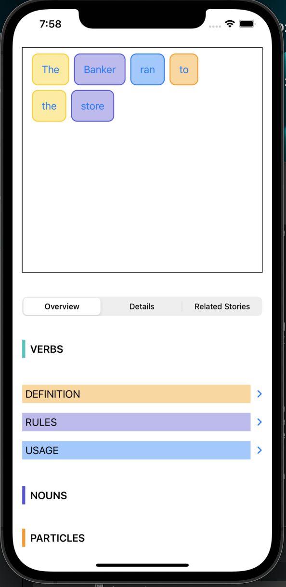

# What I'm currently working on: 

An app that facilitates learning the arabic language. The app focuses on building strong fundamentals in the language with practical excercises spread throughout the app. 

## Initial Designs

### How it began

### How its going currently: 

### One interesting challenge of this app: 

SwiftUI is a great declarative framework. Without a doubt, one of the most commonly used `View` is the `HStack`. However, one of the core features of this app is displaying every word as a button of it own and with contextual coloring giving the user more information at a glance. Sadly, there is no native way to make views self-wrap in a given `HStack`.  

There is a nice post on this issue, [here](https://stackoverflow.com/questions/58842453/swiftui-hstack-with-wrap) on StackOverflow but that implementation wraps its views by use a ZStack and might lead to problems down the line (because I have plan to use the remaining space in the Rectangle with some extra details on whatever word the user clicked on). So I created my own self-wrapping HStack. Albeit crude, it works fine for this use case. 
